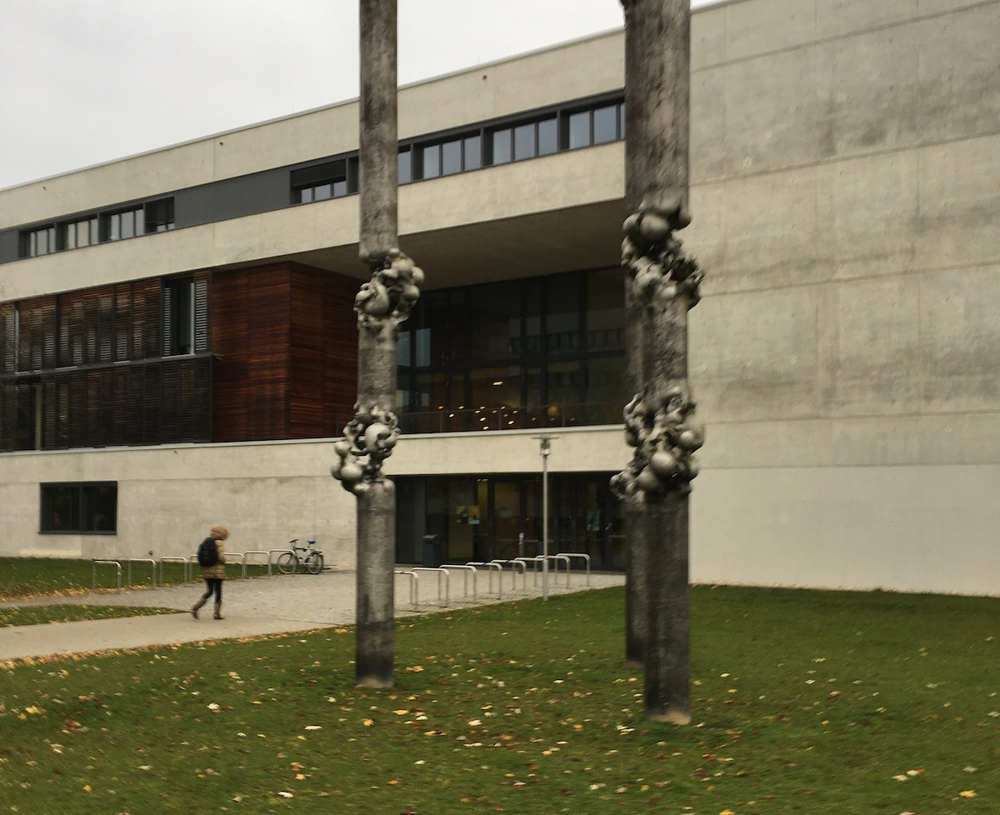
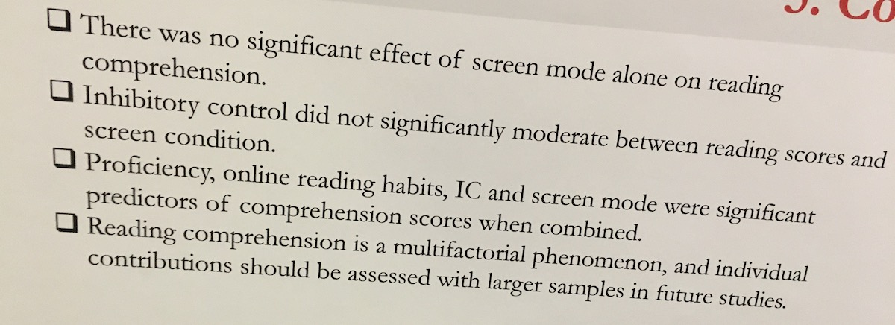
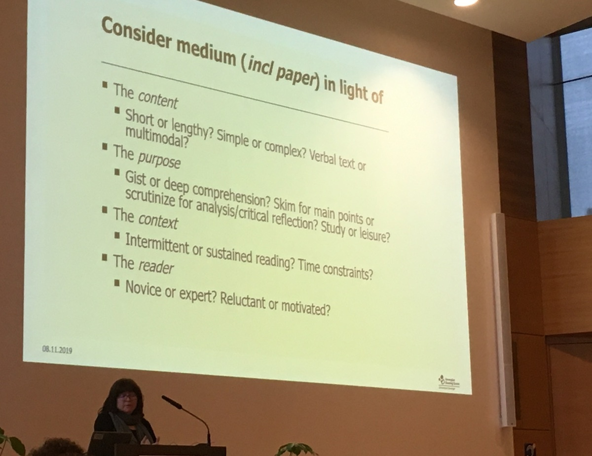
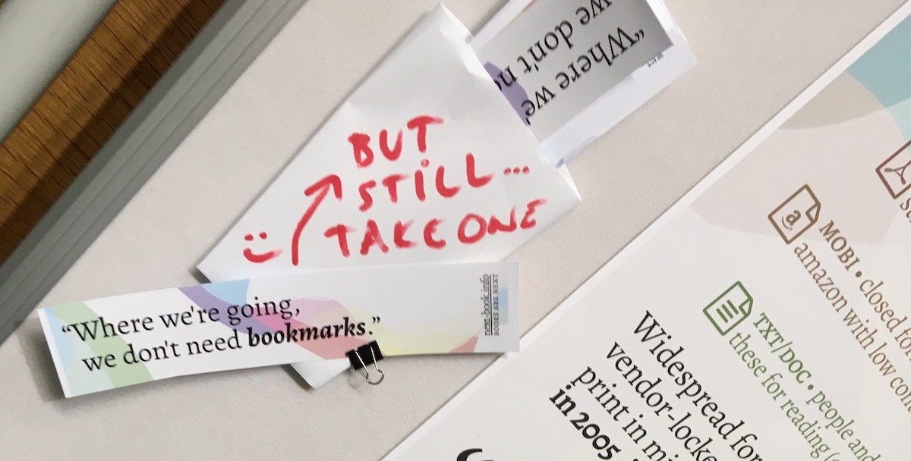

<figure>

</figure>

First of all, thanks to the organizers! I’ve met a lot of new people and attended some great sessions. And, of course, a lot of new questions popped up. Here are some quickly drafted notes.

## Paper or display?

As expected, this is the most frequently asked question. Is either of those better than the other? Interestingly, most studies come with a definitive „well, maybe not.“

<figure>

</figure>

In most studies, there’s no significant difference in various metrics related to reading. Sometimes there’s some specific difference that can be frequently explained by 

- inexperienced use (awkward handling of tablets, constrained lab device use),
- recreating paper/digital experience (in either direction) to create a measurable experiment, nullifying the possible differences,
- disregarding the specific digital interfaces that change rapidly as the platforms evolve (even Kindle evolves quite rapidly in this context),
- gradual increase of use of digital devices in reading as the technology becomes more refined, but users developed their behaviors earlier and did not accommodate yet,
- or “shallow” reading habits/behaviors which even [bleed into paper-based reading][bleed].

This is not to say that these studies are meaningless or saying nothing. Also, these criticisms were frequently addressed in the posters and talks right away. I learned a lot today! (And most of what’s been said supports my focus on the software side of e-reading, so that’s a great validation).

## Display or display?

One question kept brewing in me since [Anne Mangen’s keynote][mangen]: is *digital/screen* really a *single medium*? We regularly consider cinema and TV to be different media, as the technologies and their social use are different.

However, it’s very much **not apparent** that the tech behind PDFs, e-readers, or websites is very different. This might be the point that invalidates in extensive measures the conclusions of many talks and posters.

Few people mentioned a distinction between e-ink and the other displays, but again, this notion disregards specific interfaces — buttons/touch, scrolling/jumping, animations, annotation functionalities, typography, etc.

As it is crucial to be careful in assessing how to approach paper/digital in specific uses, I believe it is essential to be much more granular when delineating the media and, therefore, **abolish the notion of digital/screen/display media category**.

<figure>

</figure>

## Reading is a lot

This became the second theme of the conference — maybe even overshadowing the first one as the talks continued. Multiple sessions, crowned by [the last one][schneider], asked *what is reading*?

On the one hand, it’s good to connect all the dots in the reading puzzle and bring all the concerned experts together. Then again, reading is basically all the stuff you do while you read — e.g., annotating is reading, staring into the ceiling is reading, reading the 135th interesting excerpt aloud to your annoyed roommate is reading, even going to pee is an activity that furthers your reading ability.

This might be an example of conceptual overstretching (for some), but it hammers the point that digital reading serves poorly in many situations. For me, this applied up to this day mostly for niche readers’ needs (e. g. poor annotation capabilities) and reduced social use of books (e. g. browsing friends library), but now I know there’s *a lot more that can go wrong*.

> Always good to learn some new stuff, innit!

## People read less

And this is not some general finding — the people who should read the most are reading less. And that’s alarming. The “long long-form” (\~novel) is in decline even in an academic setting.

I think this might be attributed to factors such as:

- The current digital solutions are often limited in contrast with their paper alternative, and they’re hard to extend — frequently it’s not a matter of technology, but a business need (as hard as it is, this creates a context, where PDF shines brightly — as something that can be mangled, tortured, cut apart and stitched together and it still works).
- New tech still finds its place and big businesses find ways to teach unhealthy habits (always on, notifications, interfaces hard to put away once opened).
- Changing nature of elementary and high school education (in too many ways to be specific, but the impact of digitization is not small).
- Today’s students find themselves in more precarious circumstances — and not only in the US; I have just a limited experience in Czechia, but it surprised me that half of my full-time students also had a full-time job (I didn’t have the capacity to study this in-depth, though).
- And I think we can hardly overstate the impact of the internet platform creators (Google, Facebook, Apple, Amazon) who use techniques that “enhance user engagement“ that retrain information behaviors of all their users. This is especially relevant in the case of the once hopeful “digital natives” ([one of the speakers][salmeron] talked about method of training users to use Google Search critically).

## That’s all

Thanks to everybody who dropped by and talked with me about the *next-book* open web publishing platform (see [the poster][poster])! If you’d like to know more, check our website at [next-book.info][nb]. 

If you liked these notes or the poster, maybe subscribe to our [newsletter][nb]. It’s short ([see][nl-archive]) and it goes out every other Friday. I’ll compose the next one right after I publish this ☺️.

Also, you may want to follow me on [twitter][tw] or to discuss this [article there][tweet].

<figure>

</figure>

[nl-archive]: https://us20.campaign-archive.com/home/?u=f81ac979da2d23765713d081e&id=89f546e1fd
[poster]: https://twitter.com/endlife/status/1192375785010712576
[tweet]: https://twitter.com/endlife/status/1192918506951598080
[bleed]: https://www.theguardian.com/commentisfree/2018/aug/25/skim-reading-new-normal-maryanne-wolf
[tw]: https://twitter.com/endlife
[nb]: https://next-book.info
[mangen]: https://www.uni-regensburg.de/bibliothek/veranstaltungskalender/reading2019/programme/index.html#Mangen
[salmeron]: https://www.uni-regensburg.de/bibliothek/veranstaltungskalender/reading2019/programme/index.html#Salmeron
[schneider]: https://www.uni-regensburg.de/bibliothek/veranstaltungskalender/reading2019/programme/index.html#Schneider
