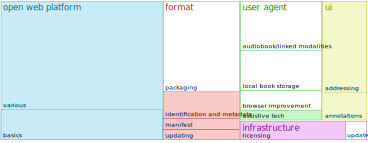

> We attempted standardization before experimentation and incubation. Clear business needs have been hard to find.
>
> — [Publishing WG Telco, 2019-07-01][telco]

WPUB intended to bring publishing to the open web. I've been observing the drafting process over the last two years and simultaneously (re)writing a comparison between WPUB and [next-book][nb], a cute octopus-shaped project I’ve been working on. 

This might be the right moment to ship the article because WPUB is fading away, and more importantly, the value proposition of publishing on the web is *quite monumental*:

> We believe there is great value in combining this older tradition of portable, bounded publications with the pervasive accessibility, addressability, and interconnectedness of the Open Web Platform (OWP). **New models of economic sustainability and innovative experiences of knowledge depend on this.** 
>
> — [Web Publications Use Cases and Requirements][ucr]

*Note:* If there’s anything wrong or mistaken, please don’t hesitate to write me an [e-mail] or tweet at me at [@endlife][tw].

[nb]: https://next-book.github.io
[ucr]: https://w3c.github.io/dpub-pwp-ucr/
[wpub]: https://w3c.github.io/wpub/
[telco]: https://www.w3.org/blog/dpub/2019/07/02/publishing-wg-telco-2019-07-01-future-of-wpub-shape-of-audiobooks/
[tw]: https://twitter.com/endlife

## Audience and structure

I write this for those who work in e-book publishing (**#eprdctn**) and feel that the existing environment is very limiting, and especially if they’ve been watching the WPUB draft development. 

> If you never heard of WPUB until today and still want to learn about next-book, you might want to check [these annotated slides from my Nov 2018 talk][slides].

First, I’ll explain what next-book is, because its comparison with WPUB is what makes this article tick — both approaches appear similar in broad terms but differ in ambitions and solutions.

Then I’ll try to explain what feels wrong to me about WPUB spec. And later I’ll try to convince you to join the next-book permanent revolution… or maybe just to check out the prototype.

[slides]: /archive/next-book-openalt-2018/

## The idea of next-book in 100 words

*The web* [was created for documents][www]. Over the last 15 years, apps and flashy microsites have become a significant part of the web. Those started to set goals for browser development. Browsers transformed from simple document viewers to powerful programming environments with fantastic presentation powers.

Next-book wants to take this power back and use it to display publications. Instead of developing a new spec for browsers, next-book uses existing open web technologies.

Not everything can be done this way (packaging, local management), but we can take off and open the publishing to experimentation that is *severely constrained* by current tools.

[www]: https://www.w3.org/History/1989/proposal.html

## EPUB, WPUB, and next-book

I draw the comparison in very broad strokes, please shout “objection!” if you see any error in my thinking (and then ping me on [twitter][tw] maybe, if you are not in a hearing distance).

<figure>

</figure>

**EPUB** is a standard derived from the open web standards, living aside in its own environment.

**WPUB** would be a standard building on top of the current open web standards, adding features required for publishing and reading publications.

**Next-book** would be a set of extendable standards implemented with open web technologies to enable advancements in publishing and reading.

## What are the essential parts of the next-book prototype now?

Source
:  Basic structure of a publication is defined. This structure is expressed in every HTML file that contains its text, so a generator is used to bind the book together from source HTML.

Generator
: There’s a generator that builds/binds the book from HTML and other resources ([nb-mapper]). It mainly adds markup to make parts of the book addressable and produces a canonical form of a book.

Book interface
: In-browser code builds upon this structure and provides some browser UI and APIs ([nb-base]).

Trace storage
: A library-like app (running as an app locally or on a server) stores books and user-created data. This part of the infrastructure is not written yet.

<figure>

</figure>

[nb-mapper]: http://github.com/next-book/nb-mapper
[nb-base]: http://github.com/next-book/nb-base

## Severely constrained?

Current e-publishing formats are locked in specialized apps and hardware. (Sometimes these digital libraries [get demolished][msdrm].)

Mobi is obvious; EPUB is open, but it relies on an ecosystem of several vendors that are not interested in environment cultivation — e.g., when Apple enhances EPUB, it becomes proprietary, branded as iBook and usable only in their own authoring and reading apps.

Hacking a book collection together with Calibre should be for hackers, but currently, it’s the only way of gathering all your books on a single shelf (sometimes even illegally).

[msdrm]: https://www.npr.org/2019/07/07/739316746/microsoft-closes-the-book-on-its-e-library-erasing-all-user-content 

### What is impossible with today’s browsers

Browsers are now getting “streamlined“ in ways that hinder their use for web navigation (such as concealing the path in the address bar), but they’re still usable as a general way to reach any HTML file on the web.

But there’s one area that’s beyond hic sunt leones.

**Local content management** of books and apps needs primary conceptualization. [Offline apps (PWAs)][pwas] are technically viable, but the experience is still confusing: surviving disconnection feels natural (just a bit spooky), but it still feels weird to type a web URL into address bar while offline.

Both apps and PWA-wrapped documents are hidden somewhere in your browser. No interface allows navigation between locally available apps or even manage their state, check current code against the origin, and export/import their state and code from/into the browser, etc., etc. Something like this would be a game changer — and not exclusively for publications.

### Audiobook-players

**Audiobooks based on the web technologies are another exciting area of development**, especially when the aim is to link the modalities (text, audio, video, etc.) and/or to extend the notion of responsive design to non-display devices.

I’d love to have an audiobook player that allows me to continue *listening* where I finished *reading* the last time — but maybe I just love the idea. 

*A real innovation™* would be to share a reading experience with someone else who uses a different modality in the same book: *“check my annotations in your audiobook!”*. Audiobooks [seem to generate some broader interest in partners of WPG][telco], so let’s hope it turns okay.

[pwas]: https://en.wikipedia.org/wiki/Progressive_web_applications

## Constructive criticism of WPUB spec draft

Here I’ll react to the [Web Publications Use Cases and Requirements][ucr] doc. The main [WPUB spec][wpub] in its current form describes primarily the manifest that binds the publication together, and my objections to it are mostly technical and quite reconcilable.

Before I start, I’d like to stress that I write from the point of a view of one excited designer, aware of my limitations and of the colossal scope of what is a W3C spec development (both WPUB and EPUB). If you find my criticism misplaced or wrong, please tell me.

### No clear concept of a publication

I’m not sure what is the supposed starting point of the [Use Cases and Requirements][ucr] doc aside from „what’s wrong with e-books.“ The spec misses any historical conceptualization of a publication such as found in [Amaranth Borsuk’s The Book][thebook], who distinguishes a book as “object, content, idea, and interface.”

This might help when structuring those “certain requirements from print media that users desire” in a kind of McLuhanian effort, establishing how the technological progress could improve the use of a medium. In the 90s we were outdating paper-based practices, now we’re outdating VGA/CRT- and dial-up-based practices. 

WPUB works with a very broadly defined “publication” and that comes at a cost: it covers almost anything that can be bound in a volume, but it also conceptually chains us to everything that ever had been bound in a volume.

**Sometimes WPUB treats a publication as a content**, especially when considering [what is essential a what is not][req7]. From a book-reading or even web-browsing perspective, this feels wrong — would I want to treat typesetting of a book as non-essential? 

There’s probably a value in trimming books down to basics for specific uses. Though, wouldn’t it be better to follow some predictable and broad rules than just expecting that every book will have two or more well-defined tiers of volume? I don’t know.

**Sometimes WPUB views a publication as a photocopy of a printed book**, keeping the structure of a paginated volume. Is this the right way to structure a digital hypertext-enabled content? For example, the spec refers to “answers in the back” of a textbook:

> Chandrasekhar has been assigned a set of exercises in his 
  math WP textbook. To double check his work, he wants to easily navigate to the answers in the back of the WP. ([UC42])
>
> The answers of the test are given at the end of the publication. ([UC88])

Some uses such as alphabetically ordered “Encyclopedia of Stuff” ([UC40]) feel outdated in a digital format. Not necessarily wrong to be published as a publication, but it does not feel right to apply a concept of “a reading order” to them. 

[req7]: https://w3c.github.io/dpub-pwp-ucr/#r_const-res

### Defining a publication
 
When working on next-book, it took us some time to arrive at a definition of what a book is — we came to something along the lines of *“a self-contained, static, rich, mostly linear, longer text that the reader might want to read in large chunks”*, where reading might include all manner of active reception. Yes, it’s not easy.

We wanted to create a basic building block of a very wide spectrum of social interactions: from reading calmly in a public space to searching in the book collection via regular expressions to browsing through the bookshelf at a friend’s house.

Also, we did not want to use any form of the word „consumption“ as the description of what people primarily do with publications. Maybe that’s what made us keep the word “book” in the name instead of the more general term — it’s reasonable to **widen the application** of a standard and to **focus on a core concept** to keep it stable at the same time.

I believe it’s important to intentionally exclude from a definition many things that ever existed on paper solely because paper was the only medium that carried print. Without such discussion, we drag the future into the past.

[UC40]: https://w3c.github.io/dpub-pwp-ucr/#uc_reading-order_alphabetical
[UC42]: https://w3c.github.io/dpub-pwp-ucr/#uc_toc_answers
[UC57]: https://w3c.github.io/dpub-pwp-ucr/#uc_print-page_skip_to_page
[UC88]: https://w3c.github.io/dpub-pwp-ucr/#uc_progresssion_testing
[thebook]: http://www.amaranthborsuk.com/publications/the-book/

### In-book addressability

**There’s a need to make the publication traversable** so that various interactions can happen: getting back to reading where I stopped, annotating and manipulating the text.

There’s a [use case][UC57] that requires easy findability of a place in digital content that might be referenced by page and paragraph number in an equivalent printed publication. 

Dropping some anchors into the text is easy as pie, but keeping layout-dependent attributes from print in sync with a digital copy is a laborious manual work (don’t even get me started on commonplace publishing processes in parallel production of both printed and digital content).

Moreover, most textbooks (referenced in [UC57]) already use fine-grained numbering systems. And you may always fall back to search in digital environments if everything else fails.

Similarly to the above mentioned alphabetic ordering of content, referencing pages in a digital publication might help in specific cases, but I’d generally prefer going the other way. A more robust solution such as auto-numbering all paragraphs or sentences (as it’s done in next-book) might bring the scaffolding that provides addresses for the manual use and also for the computer to traverse.

### Packaging

**There’s a lot about packaging in the spec, but there’s very little about managing those packages.**

On the one hand, the spec propels audiobooks into the hypertextual present, abolishing the hell of folders full of (hopefully well-tagged) audio files. The *inside* of an audiobook becomes multidimensional, explorable, interactive and rich.

> My first “e-book” was a bunch of 400-something characters long plaintext files. I split “Life, the Universe and Everything” by Douglas Addams into 400-character-long files to make it work on my [Siemens S45][s45]. Folders full of `.txt` files worked for me well back then.

On the other hand, books themselves (audio- or not) remain to be accessed either as a packaged file stored in the filesystem or — reluctantly — via server (by URL). Every book is an island.

I think that we need a platform that goes beyond a book and uses the generalized structure of a publication for higher goals — such as collaborative annotation practices or just public display of a personal library. These are either easily achieved with printed books (sharing annotations) or ridiculously hard (splitting private and public annotations). I believe that such platform should be standardized together with the publication itself.

Reference managers such as Zotero, Mendeley, or Bookends work in a very similar way already: just working with web content is *a pain* (and other commonly used formats in academia are just pathetic in their internal structure). 

In effect, it might look similar to the current crop of e-reading apps, just opening the publication in the browser and pulling the user-generated data. Possibly via an in-app server, nixing the issues related to accessing the book as a local file.

I’d love to manage my local content in one place (and in the dreamy future, to have the PWAs displayed there too). Please don’t mix up this wish with abolishing the raw filesystem: on the contrary, I want a nicely presented access to the stuff that is now stored in my browser’s hidden temporary folders.

[s45]: https://en.wikipedia.org/wiki/Siemens_S45

### Kill the WP user agent

There’s a mention of *non-WP (non-Web Publication) user agents* that should be able to access “at least (…) basic functionality of the book” in a manner of progressive enhancement. This once again builds a wall between open web and Web Publications (*optimized for WP-agent and 800\*600 resolution*).

Let’s abolish the notion of a *specialized WP user agent* entirely. Publications can be still enhanced in various agents (browsers, browser plug-ins, e-ink readers, audio players), but making full-fledged browser the central node brings in all the potential of an open platform.

Stop half-way and e-books will still be the pain very akin to HTML e-mails, painstakingly supporting rendering engine from MS Word 2007.

Also, meeting together on the open web is much better for accessibility and internationalization. I somehow cannot accept that the doc needs to mention the necessity of good support for right-to-left writing or for privacy settings. That should be the device/browser’s vendor’s job.

### No such thing as society 

The spec is concerned mainly with the single-user consumption and overlooks most of the broader array of social interactions. 

The spec mentions studying together from multiple copies of the same publication ([UC57]), returning a book back to the public library and moving on to buy a digital copy ([UC58]), annotating an article from someone else ([UC126]), or offline lending to a friend ([UC73]).

Digital publication is still seen as an artifact that I can hold in my hands, instead of a piece of data in the network, readily being displayed by multiple devices *at the same time*. When packaged, it becomes a file with a generic icon in a folder somewhere on my computer. Or maybe loaded into a reading app that displays its *cover*.

But there’s more to book than this.

- What about public libraries and web publications?
- What about sharing the joy of my bookshelf with a visiting friend?
- How do I present web publications on a book-fair?
- How do I split my private annotations from those I want to send to my colleague and those I want to publish on the web?

There’s a lot to be explored: and no, there’s no clear answer to those questions. But the open web is required not only as the place to *find the answer* but as the place to *ask the question*.

Only with the open platform can be the crazy ideas tried and executed. *“Let’s scrape all linked content that is in public domain or CC-licensed and include it in the generated book so that the offline experience gets better and the web gets incidentally archived!“* or maybe *“Reading UI should include tools for editing the text of the book, so that readers may cut those Foucault’s sentences into paragraphs and rearrange the ideas as they struggle to interpret them.”* Are these ideas good or a bad? I don’t know, let’s try.

Even in the spec, there’s a mention of a need for robust versioning ([UC126]) that enables annotations to withstand changes in the book’s text. Versioning itself is a very social activity that changes a lot of what we see in books: they are immutable by definition. Books are printed, and that’s it. There’s a lot of work that needs to be done so that things like this get well accepted and used.

[UC73]: https://w3c.github.io/dpub-pwp-ucr/#uc_pwp_offline_lending
[UC58]: https://w3c.github.io/dpub-pwp-ucr/#uc_print-page_bookmark
[UC126]: https://w3c.github.io/dpub-pwp-ucr/#uc_component-change_differential

### Overview

How hard is it to implement solutions to comply with all the requirements in the [Use Cases and Requirements][ucr] doc using only the existing open web technologies?

I tried to roughly categorize the use cases ([categorization in CSV](./wpub-use-cases.csv)) and arrived at six unevenly defined categories of use cases. I marked with an asterisk in the table (and color fill in the chart below) requirements that can be met by solutions using just the existing open web platform.

<table>
  <tr><th>UC&nbsp;count</th><th>requirement</th></tr>
  <tr>
    <td>26</td>
    <td>
      <strong>structure/format definition</strong>: 
      packaging (17) 
      identification and metadata (*5) 
      manifest (*2) 
      updating (*2)
    </td>
  </tr>
  <tr>
    <td>13</td>
    <td>
      <strong>specialized UI</strong>: 
      addressing parts of a book (*10) 
      annotations (*3)
    </td>
  </tr>
  <tr>
    <td>6</td>
    <td>
      <strong>additional infrastructure</strong>: 
      licensing (*5) 
      updating (1)
    </td>
  </tr>
  <tr>
    <td>24</td>
    <td>
      <strong>user agent development</strong>: 
      audiobook players/linked modalities (10) 
      local book storage (8) 
      browser improvement (4) 
      assistive tech (*2)
    </td>
  </tr>
  <tr>
    <td>2</td>
    <td>
      solve <strong>problems that arise from other parts of the spec</strong>
    </td>
  </tr>
  <tr>
    <td>*55</td>
    <td>
      requirements that <strong>can be met by solutions using just the existing open web platform</strong> and do not overlap with the categories above
    </td>
  </tr>
</table>

The last category is obviously a lazily assembled mixed bag of requirements; however, their unifying attribute is critical. (Included are the first 12 UCs that mostly reiterate through the current basics of the open web platform.)

I’d add most of the first three categories (29 in total): 

- 9 of the format-related use cases, 
- 13 of the UI category, 
- all 5 of the licensing ones, and 
- both of the assistive tech 

<figure>

</figure>

**That makes 84 out of 126 UCs easy to solve within the open web platform in its current shape.** The rest covers topics such as book packaging and offline storage (25 UCs) and user agent development (14 UCs). Two UCs solve spec-related issues.

But I’d very much like to stop brandishing these silly numbers. There are two important take-aways:

1. There’s a lot that can be done with current web technologies.
2. This list was created as a retrospective look into shortcomings of e-books, not as a look into social practice of reading — as a result, it’s very much incomplete.

## Alternatives

From time to time, I check on [ReadiumJS/Web][readium], but supporting EPUB on the web makes me very nervous. It’s like the return of the prodigal son, but meanwhile, the son became a part of a [Borg Collective][borg]. I don’t see any fattened calf in there.

When we started thinking about the soon-to-be next-book in late 2016, I checked the priorities outlined for EPUB development, and those made me sad (mostly relying on [charter from 2010][charter]). Since then [good things happened][beyond], though I mostly avoided delving deeply into EPUB itself. (Also, it’s painful that EPUB3 is still considered to be *the new one, not compatible with many devices*.)

This is the dark side that I have to acknowledge: I knew little about EPUB when we started defining and implementing next-book.

I still don’t know too much now, and most of what I register are terrified shrieks published under [#eprdctn] hashtag (okay, it’s not that bad, but it doesn’t feel comforting). I worry that a lot might be lost with the transition to the open web, but at the same time, I do think it’s worth the opportunity of opening the possibilities.

Thus, anything worth taking over from EPUB to the open web *as is*, let’s take it. Also, converting existing books shouldn’t be too hard.

### Book and static website generators

Book production projects like [GitBook] and [Magic Book] are comparable to static website generators (such as [Hugo], [Jekyll] or [Gatsby]). 

Their focus on books comes from the fact that they pre-date the static/[JAMstack] hype or because there’s a twist to the formula — for example, [GitBook] provides an excellent UI for writing, and though it carries “book” in its name, it focuses on documentation.

The docs, references, and specs are just a few of the print-based formats already made obsolete by their much easier-to-use digital alternatives: documentation generators with support for easy versioning *and* Q&A sites such as [Stack Overflow] or [Quora].

Next-book is adopting the static generator process and similarly tries to produce a book: focusing on delivering a better experience for readers of non-fiction, novels, long reads, fan-fiction, scientific literature, etc.

[#eprdctn]: https://twitter.com/search?q=%23eprdctn&src=typd
[charter]: http://idpf.org/epub/30/wg-charter
[beyond]: http://epubsecrets.com/epub-and-beyond-digital-publishing-w3c.php
[readium]: https://readium.org
[borg]: https://en.wikipedia.org/wiki/Borg
[GitBook]: http://gitbook.com/
[Magic Book]: https://github.com/magicbookproject/magicbook
[Hugo]: https://gohugo.io/
[Jekyll]: http://jekyllrb.com/
[Gatsby]: https://github.com/gatsbyjs
[JAMstack]: https://jamstack.org
[Stack Overflow]: https://stackoverflow.com
[Quora]: https://www.quora.com

## The current shape of the next-book

It’s (not just) an idea.

There’s a working second generation prototype (book generator and browser code). The prototype is not the next-book, it’s a working implementation. Tech detail: Generator works on top of [jsdom], browser code uses [react]+[Redux].

It’s incomplete, buggy, and not [well documented][docs], sometimes the prototype *is the documentation* of the idea. Many ideas are just coded in, as the field is so vast (possibly more than ten football fields). Some ideas are just mentioned somewhere in the many mind-maps and docs written over the years.

There’s no prototype of the *sync functionality* — a web service that stores book’s state and allows keeping the book in sync over different devices. Publishers, book clubs, local “bookshelf” apps, etc. may use such a service. (Locally managed server might be the way to overcome the packaging limitation of current browsers — and maybe to free browsers the problem completely.)

Everything’s [up on Github][gh]. Licensed under MIT License, though I’m considering a switch to GNU GPL.

There’s a reference edition of [Lawrence Lessig’s Free Culture][fc] ([source code][fc-code]). Right now there’s a project backed by a Czech publisher [Nová Beseda][beseda] that focuses on annotation practices and allows me to work on next-book part-time (last year some publishers tried next-book in a similar project and [produced their own books][nbeu]).

Only a handful of people touched the code, most of them not voluntarily (just another assignment in an IT job at a publisher). There‘s no real community yet.

I’m aware that I might be rediscovering the wheel, but there are *so many* wheels that you need to mount on every web project.

[gh]: https://github.com/next-book
[fc]: https://next-book.github.io/free-culture/
[fc-code]: https://github.com/next-book/free-culture
[nbeu]: https://next-book.eu/en/
[docs]: https://next-book.github.io
[beseda]: https://www.novabeseda.cz
[jsdom]: https://github.com/jsdom/jsdom
[react]: https://reactjs.org
[redux]: https://redux.js.org

## Next steps

Get next-book to conform with WPUB manifest spec as much as possible so that next-book effectively *becomes WPUB*.

Bring the in-browser UI of a basic next-book to the level of a standard e-book.

Start collaboration with some institution that creates book-shaped content (e.g. fan-fiction, public domain classics) to produce next-book at some scale over the summer. (I’ve been eyeing [Standard E-books][standard] for a long time.)

Work with an academic publisher (or similar) that produces books at scale so that next-book is tested in a production environment.

Start tracking the development of all next-book code publicly using Github issues.

Cover the code of the prototype with automated tests to make contributing easier.

**Bring in more people so that the project gets a more realistic outline** — in its vision, scope, short term goals, etc.

[standard]: https://standardebooks.org

## *The* call to action

If you feel that any of the above is in any way good, please let me know.

If you’d like to join forces in any way, please let me know right now!

If you know about any organization possibly willing to cooperate or fund the development and organizing somehow, please link us up.

Fly me an [e-mail], ping me on [twitter][tw], report an issue on [github][gh].

Let’s find a way forward — to discuss, to cooperate, to publish. I want to know whether this is a workable future for me (feasible — not certain, of course) by March 2020, so any encouragement is very appreciated, help or cooperation even more so.

### A side note: business?

I did not mention the business side of things. It’s vital to create a sustainable solution, and that requires people getting paid for what they create. I hope that people will get paid for the books they publish — and I hope that I’ll be able to publish and read them too.

In the long run, even the standard development needs to become sustainable, but that’s not a problem to tackle right now. (I’m going to try to establish a funding platform for my own work, but that might not cover all that’s needed for next-book, even in the short term.)

## Credit

I’m mostly to blame for the development of next-book in the last two years. It would be much harder without support from [Nová beseda][beseda] publishing house, and it would not exist without a very intensive first six months of idea development with [Ivana Lukeš Rybanská](https://twitter.com/ifcen). Thanks!

[e-mail]: mailto:info@jan-martinek.com

