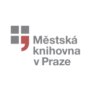
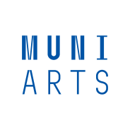
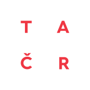

We’re happy to become members of a team that works with Prague’s Municipal Library and Masaryk University on a project called _Redesign of library services 2020_.

**Project summary:** The COVID-19 pandemic closed the public library for months, but did not dampen reading. During the pandemic, the number of downloads of electronic books from the catalog of the Municipal Library in Prague increased by more than 400%. This trend has revealed several problems: limited accessibility of e-book formats dependent on specialized SW and HW, the lack of community services supporting digital reading, or comprehensive methodologies for assessing the return on investment in digital services. The aim of the project is to make books in the catalog accessible in a browser-readable form based on the cooperation of experts from sociology, information science, IT, design and economics, to create and test new digital community services tailored to users and measure the ROI of web books.

Project is funded in part by the [Technology Agency of the Czech Republic](https://www.tacr.cz).

